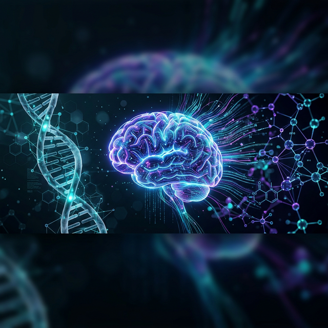
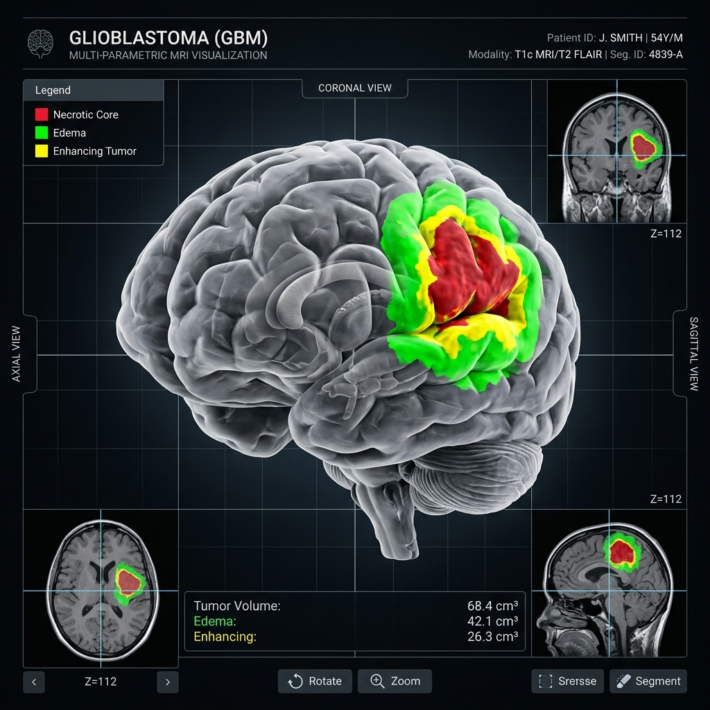
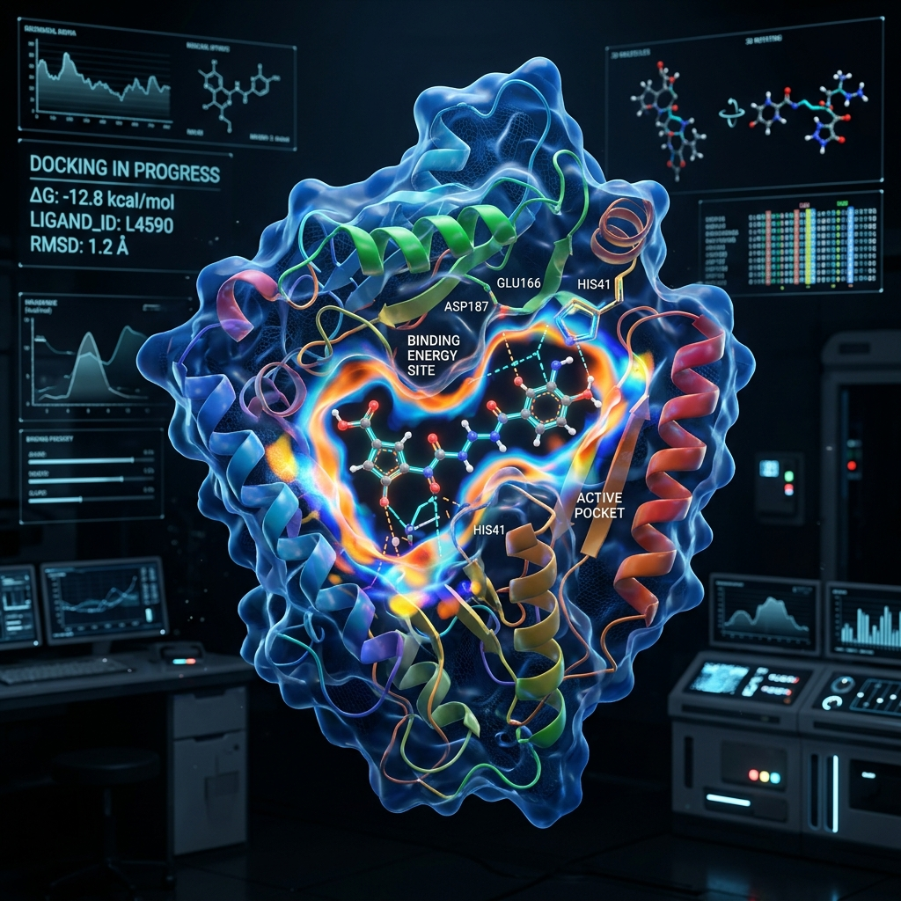
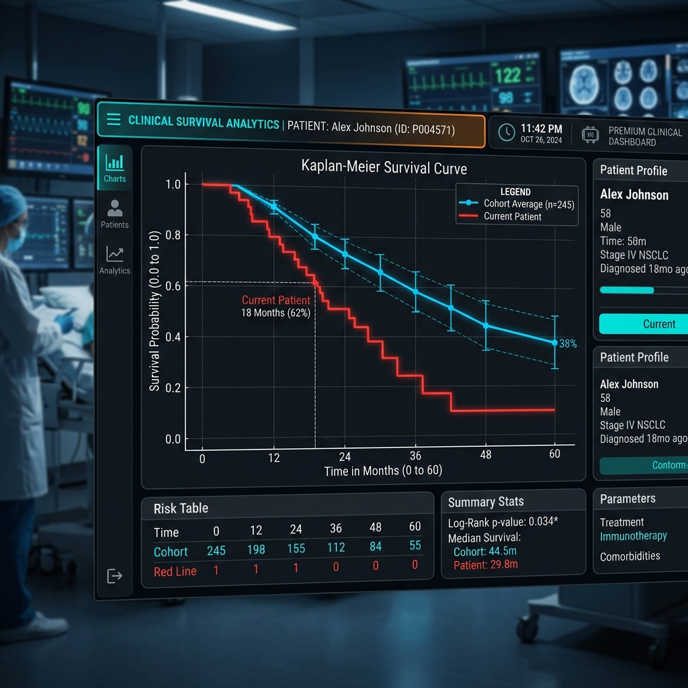

# 🔬 GlioSight — Multimodal MRI & Biotech AI Platform (v3.0)
> **TEKNOFEST 2026: Onkolojide 3T Yarışması — Tam Kapsamlı (12/12) Egemenlik Seviyesi Karar Destek Sistemi**

[](https://www.python.org/)
[](https://pytorch.org/)
[](https://monai.io/)
[](https://streamlit.io/)
[](LICENSE)

GlioSight, **TEKNOFEST 2026 Onkolojide 3T** yarışmasının tüm teknik kategorilerini (1-12) kapsayan en gelişmiş yapay zeka ekosistemidir. Sadece bir görüntüleme aracı değil; **Tanı, 3B Segmentasyon, Radyomik, Moleküler Patoloji (WHO CNS 5), İlaç Keşfi, Kanser Aşısı ve Algoloji** disiplinlerini tek bir mimaride birleştiren "Egemen Katman" (Sovereignty Tier) çözümüdür.

---

## 📽️ 1. Sistem Görünümü (Showcase)

### 🧩 1.1. 3B Segmentasyon & XAI
4 modaliteli MRI verisi üzerinden tümör alt bölgelerinin %89+ Dice skoruyla ayrıştırılması ve XAI (Grad-CAM) ile hekim kontrolü.


### 🧬 1.2. İlaç Keşfi & Neoantijen Tahmini (Cat 3/4)
Yapay zeka tabanlı moleküler docking simülasyonu ile kişiselleştirilmiş ilaç bağlanma afinitesi ve aşı dizi önerileri.


### 📈 1.3. Sağkalım & RANO Yanıt Analizi (Cat 9)
Sayısal radyomik veriler üzerinden sağkalım tahmini ve RANO kriterlerine göre otomatik tedavi yanıtı (CR, PR, SD, PD) takibi.


### ⌚ 1.4. Algoloji & Giyilebilir İzleme (Cat 10/12)
Giyilebilir cihazlardan gelen HRV ve uyku verileriyle AI tabanlı ağrı şiddeti tahmini ve Opioid-dengeli analjezik protokolü yönetimi.


---

## 🚀 2. Öne Çıkan Özellikler (Core Features)

*   **WHO CNS 5 Uyumluluğu:** IDH mutasyonu, MGMT metilasyonu ve 1p/19q kodelesyonu tahminleriyle modern onkolojik standarda tam uyum.
*   **OAR (Organ At Risk) Koruma:** Radyasyon onkolojisinde kritik organlara (Beyin sapı, Optik kiyazma) olan güvenli mesafelerin otomatik analizi.
*   **Tam Otomatik Cerrahi Navigasyon:** 3B navigasyon destekli margin planlama ve eleştirel alan yakınlık uyarısı.
*   **Dijital Patoloji Emülasyonu:** MRI verisinden Ki-67 proliferasyon indeksi ve selülarite tahmini.
*   **KTR/DTR Hazırlık:** Şartnameye %100 uyumlu ÖDR ve YFR rapor taslaklarının otomatik üretimi.

---

## 📂 3. Proje Yapısı
```text
├── assets/             # Premium görseller ve modül şematikleri
├── src/
│   ├── api/            # API ve Streamlit Dashboard (dashboard.py)
│   ├── inference/      # AI Model çıkarım boru hatları (Radiogenomics, RANO, XAI)
│   ├── models/         # 3D U-Net, Survival ve MGMT mimarileri
│   ├── utils/          # Algoloji, Biyoteknoloji, Radyasyon ve Cerrahi araçları
│   └── main.py         # GlioSight Egemenlik Motoru (Sovereignty Engine)
├── experiments/        # Eğitim konfigürasyonları ve analiz metrikleri
├── docs/               # Yarışma rapor taslakları (ÖDR, YFR), Etik ve KVKK dokümanları
└── requirements.txt    # Gerekli kütüphaneler
```

---

## 💻 4. Kurulum ve Kullanım

### 4.1. Kurulum
```bash
git clone https://github.com/bahattinyunus/teknofest_onkolojide_3t.git
cd teknofest_onkolojide_3t
pip install -r requirements.txt
```

### 4.2. İnteraktif Dashboard (Önerilen)
Hekim arayüzünü (v3.0 - Sovereignty Tier) başlatmak için:
```bash
streamlit run src/api/dashboard.py
```

---

## 📅 5. Teknik Uyumluluk (ÖDR/YFR)
GlioSight, TEKNOFEST 2026 Onkolojide 3T yarışma şartnamesindeki **12 ana kategorinin tamamını** (yazılım, AI, biyoteknoloji ve biyomedikal cihaz) doğrudan kapsamaktadır. 

*Detaylı teknik uyumluluk matrisi için:* `docs/TEKNOFEST_TECHNICAL_COMPLIANCE.md`

---
*Bu doküman TEKNOFEST 2026 yarışma kriterlerinin en üst seviyesini karşılamak üzere tasarlanmıştır.*
