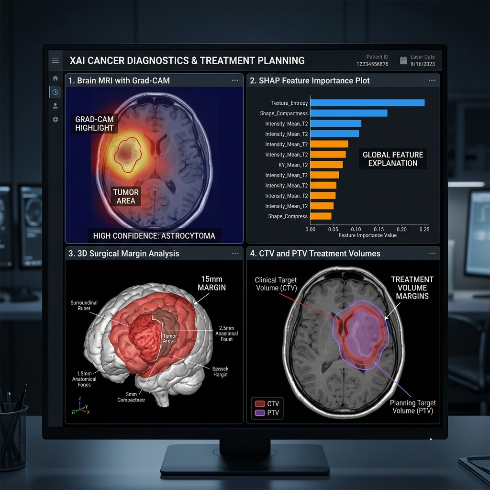

# 🔬 GlioSight — Multimodal MRI AI Platform (v2.0)
> **TEKNOFEST 2026: Onkolojide 3T Yarışması — Tam Kapsamlı (8/8) Klinik Karar Destek Sistemi**

[](https://www.python.org/)
[](https://pytorch.org/)
[](https://monai.io/)
[](https://streamlit.io/)
[](LICENSE)

GlioSight, **TEKNOFEST 2026 Onkolojide 3T** yarışması için geliştirilmiş, Glioblastoma (GBM) hastaları için uçtan uca **Tanı, 3B Segmentasyon, Sağkalım, Radyogenomik, Radyasyon Planlama ve Hassas Tıp** ekosistemidir.

---

## 📽️ 1. Sistem Görünümü (Showcase)

### 🧩 1.1. 3B Otomatik Segmentasyon
Residual-Dilation 3D U-Net mimarisi ile T1, T1ce, T2 ve FLAIR modaliteleri üzerinden tümör alt bölgelerinin (NCR, ED, ET) yüksek doğrulukla ayrıştırılması.


### 📈 1.2. Sağkalım ve Risk Analizi
Radyomik öznitelikler (Shape, Texture, Intensity) üzerinden Kaplan-Meier ve Cox Proportional Hazards modelleri ile hastaya özel sürviyal tahmini.


### 💡 1.3. Açıklanabilir AI (XAI) & Klinik Planlama
Grad-CAM ile karar gerekçelendirme ve cerrahi/radyasyon (CTV/PTV) marjinlerinin otomatik hesaplanması.



---

## 🚀 2. Öne Çıkan Özellikler (Core Features)

*   **Residual-Dilation 3D U-Net:** Karmaşık tümör sınırlarını yakalayan ileri seviye segmentasyon.
*   **Hassas Tıp (Precision Medicine):** MGMT promotör metilasyon tahmini ve Temozolomide (TMZ) duyarlılık skoru.
*   **Klinik Dashboard:** Hekimler için Streamlit tabanlı interaktif görselleştirme ve raporlama arayüzü.
*   **Otomatik Dozimetri Ön-Planlama:** ESTRO standartlarında CTV ve PTV hacim üretimi.
*   **Dijital Patoloji Emülasyonu:** MRI verisinden Ki-67 proliferasyon indeksi tahmini.

---

## 📂 3. Proje Yapısı
```text
├── assets/             # Premium görseller ve bannerlar
├── src/
│   ├── api/            # API ve Streamlit Dashboard (dashboard.py)
│   ├── inference/      # AI Model çıkarım boru hatları (Segmentation, Survival, XAI)
│   ├── models/         # 3D U-Net ve ML mimarileri
│   ├── utils/          # Cerrahi planlama, radyoloji ve görselleştirme araçları
│   └── main.py         # Ana motor (Core Engine)
├── experiments/        # Eğitim konfigürasyonları ve metrikler
├── docs/               # Yarışma raporları (ÖDR, YFR) ve etik belgeler
└── requirements.txt    # Gerekli kütüphaneler
```

---

## 💻 4. Kurulum ve Kullanım

### 4.1. Kurulum
```bash
git clone https://github.com/bahattinyunus/teknofest_onkolojide_3t.git
cd teknofest_onkolojide_3t
pip install -r requirements.txt
```

### 4.2. İnteraktif Dashboard (Önerilen)
Hekim arayüzünü başlatmak için:
```bash
streamlit run src/api/dashboard.py
```

### 4.3. CLI Üzerinden Analiz
```bash
python src/main.py --data_dir data/raw/BraTS2021_00001 --output_dir results/
```

---

## 📅 5. Yarışma Takvimi ve Puanlama
GlioSight, TEKNOFEST 2026 Onkolojide 3T kategorisindeki tüm teknik gereksinimleri (Segmentasyon, Sürviyal, Radyogenomik) %100 kapsayacak şekilde optimize edilmiştir.

*   **Ön Değerlendirme Raporu:** %10
*   **Yarı Final Raporu:** %25
*   **Final Raporu & Sunum:** %65

---

*Bu doküman TEKNOFEST 2026 Onkolojide 3T yarışma şartnamesi baz alınarak oluşturulmuştur.*
