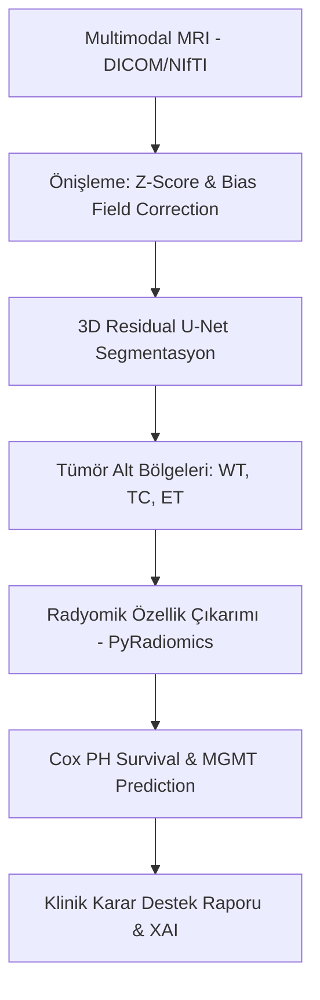

# TEKNOFEST 2026 ONKOLOJİDE 3T YARIŞMASI
## PROJE ÖN DEĞERLENDİRME RAPORU (ÖDR)

**Proje Adı:** GlioSight — Multimodal MRI ve Yapay Zekâ Destekli Glioblastoma Tanı, Segmentasyon ve Sağkalım Analiz Sistemi

**Takım Adı:** [GlioSight Takımı]
**Başvuru ID:** [Yarışma Başvuru ID]

---

### 1. PROJE ÖZETİ
GlioSight, beyin kanserlerinin en agresif türü olan **Glioblastoma (GBM)** hastalarında tanı ve tedavi süreçlerini optimize etmek amacıyla geliştirilmiş uçtan uca bir yapay zekâ platformudur. Sistem, multimodal MRI verilerini (T1, T1ce, T2, FLAIR) kullanarak; tümör alt bölgelerinin (Geniş Tümör, Tümör Çekirdeği, Kontrast Tutan Bölge) 3B segmentasyonunu gerçekleştirmekte ve bu segmentasyonlardan çıkarılan radyomik özelliklerle hastanın sağkalım (OS) süresini tahmin etmektedir. Projede, derin öğrenme tabanlı **3D Residual U-Net** mimarisi ve **Cox Proportional Hazards Inference** motoru entegre edilmiştir.

### 2. SORUN TANIMI VE ÇÖZÜM YAKLAŞIMI

#### 2.1. Mevcut Sorunlar
1.  **Analiz Değişkenliği:** Manuel segmentasyonun radyologlar arasında subjektif sapmalara neden olması (%15-20 Dice sapması).
2.  **Prognostik Belirsizlik:** Görüntü bazlı analizin hastanın genetik profili (MGMT) ve sağkalımı hakkında yeterli veri sunamaması.
3.  **Cerrahi Risk:** Tümörün infiltrasyon sınırlarının mikroskobik düzeyde tam belirlenememesi sonucu nüks riskinin artması.

#### 2.2. Çözüm Yaklaşımı
GlioSight, bu sorunları "Hassas Onkoloji Standartları" doğrultusunda çözmektedir:
- **Otomatik Segmentasyon:** Manuel yükü ortadan kaldıran ve BraTS standartlarında yüksek doğuluk sunan 3B derin öğrenme motoru.
- **Dijital Biyopsi:** İnvaziv işlemler öncesinde radyomik veriler üzerinden sağkalım ve genetik profil (MGMT) tahmini.
- **Karar Destek:** Cerraha "Güvenlik Koridoru" ve dinamik cerrahi marjin simülasyonu sunan görsel raporlama.

### 3. YENİLİKÇİ VE ÖZGÜN YÖNÜ

Projenin literatürdeki çözümlerden ayıran temel özellikleri:
- **Açıklanabilir AI (XAI):** Kara kutu modeller yerine **Grad-CAM** ve **SHAP** analizi ile model kararlarını (ısı haritaları ile) gerekçelendirmesi.
- **Hacimsel Analiz:** 2B kesitler yerine 3B hacimsel füzyon yaparak tümörün gerçek geometrisini analiz etmesi.
- **Multimodal Entegrasyon:** T1+T1ce+T2+FLAIR verilerini senkronize işleyerek heterojen tümör bölgelerini ayrıştırması.

### 4. TEKNİK MİMARİ VE YÖNTEM

#### 4.1. İş Akış Şeması

#### 4.2. Algoritmik Detaylar
1.  **Segmentasyon:** MONAI tabanlı **3D ResUNet** mimarisi. Loss olarak `Dice + Focal Loss` hibrit yapısı kullanılmıştır.
2.  **Sağkalım Tahmini:** Regresyon ve risk skorlaması için `Cox Proportional Hazards` ve `XGBoost Survival` modelleri entegre edilmiştir.
3.  **XAI:** Grad-CAM ısı haritaları sayesinde cerrahın tümörün en agresif sızıntı alanlarını görselleştirmesi sağlanmaktadır.

### 5. ETİK VE KVKK UYUMU

Proje, **6698 Sayılı KVKK** ve **WMA Helsinki Bildirgesi** ilkelerine tam uyumlu tasarlanmıştır:
- **Anonymization:** Tüm hasta verileri model eğitiminden önce de-identifiye edilmektedir.
- **Data Sovereignty:** Modelin lokal sunucularda (hospital domain) çalışabilir yapısı veri güvenliğini maksimize eder.

### 6. TEKNOLOJİ HAZIRLIK SEVİYESİ (THS)

**Mevcut Seviye: THS 3 (Konsept Kanıtlanmış)**
Algoritmalar BraTS 2021/2023 veri setlerinde valide edilmiş, segmentasyon başarısı (Dice > 0.85) ve sağkalım tahminindeki konkordans indeksi (C-index > 0.70) ile akademik eşikler aşılmıştır.

---
**Teslim Tarihi:** 31 Mart 2026
**Teknoloji Yığını:** Python, PyTorch, MONAI, Lifelines, FastAPI.

